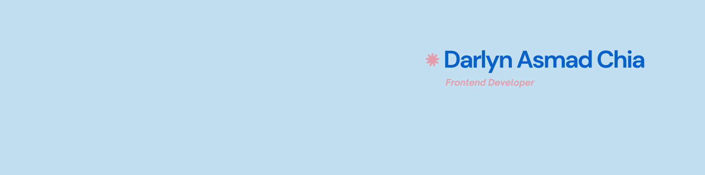

<h1>👋 Hola, Soy Darlyn</h1>

---

<a style="display:flex;" align="center">
 </a>

 ---

 ## 🛠 Tecnologías que uso

**Lenguajes:**  

**Frontend:**  

**Frameworks & Librerías:**

**Diseño & Herramientas:**

**Deployment:**

---

<!--
**DarlynZen/DarlynZen** is a ✨ _special_ ✨ repository because its `README.md` (this file) appears on your GitHub profile.

Here are some ideas to get you started:

- 🔭 I’m currently working on ...
- 🌱 I’m currently learning ...
- 👯 I’m looking to collaborate on ...
- 🤔 I’m looking for help with ...
- 💬 Ask me about ...
- 📫 How to reach me: ...
- 😄 Pronouns: ...
- ⚡ Fun fact: ...
-->
